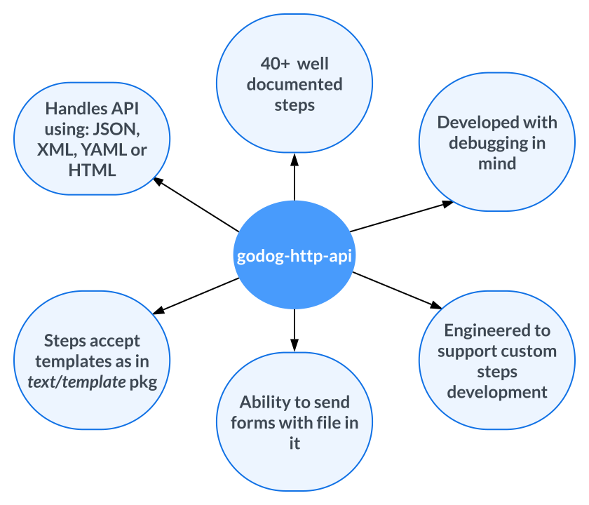
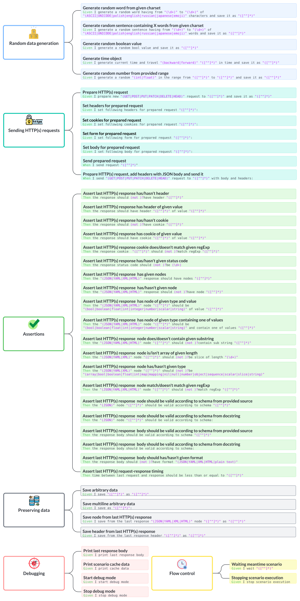

# Godog Integration Test

## Description

This is an integration test kit built with [cucumber/godog](https://github.com/cucumber/godog).

It comes pre-configured with :

1. Cucumber Godog (<https://github.com/cucumber/godog>
2. Godog HTTP API (<https://github.com/pawelWritesCode/godog-http-api>)

Shout out to [pawelWritesCode](https://github.com/pawelWritesCode) for the awesome work on godog-http-api!

## Features


To read available step definitions and documentation on how to use them, please read [godog-http-api wiki](https://github.com/pawelWritesCode/godog-http-api/wiki).

## How to Use
To use this kit, you need to have [godog](https://github.com/cucumber/godog) and [gocure](https://gitlab.com/rodrigoodhin/gocure/-/releases/v22.07.18) installed on your machine. 

For godog, use this command to install it:

```sh
$ go install github.com/cucumber/godog/cmd/godog@latest
```

For gocure, you can download the binary that fit to your os, extract the file from the release page and put it in your `$PATH` directory.

Linux 
```sh
$ cp gocure_linux_amd64 /usr/local/bin/gocure
$ export PATH=$PATH:/usr/local/bin/gocure
```

MacOS
```sh
$ cp gocure_darwin_amd64 /usr/local/bin/gocure
$ export PATH=$PATH:/usr/local/bin/gocure
```

If you can type `godog` and `gocure` in your terminal, you are good to go!

After that, you can create gherkin scenarios in `features` folder. 

Make sure to separate scenarios into different files based on the feature you are testing.

For further documentation about the step definitions, please read [godog-http-api wiki](https://github.com/pawelWritesCode/godog-http-api/wiki).

## How to Run
To run the test, you need to make sure you have installed `make`. If you don't have it installed on your machine, you can run this following command to install it:

Linux
```sh
$ sudo apt install make
```

macOS
```sh
$ brew install make
```

If you have installed `make` don't forget to run the desired application in local environment! 

For testing in the local environment, you can use [go-grpc-starter](https://github.com/rifqiakrm/grpc-starter) repository to run an example test. To run the application, please read the documentation there.

If your application is not running in local environment, you can set the `APP_URL` in the gherkin to the staging environment that have already deployed.

For example:

`features/example/authentication.feature`
```gherkin
...
  
   Given I save "https://yourappsthathavealreadydeployed.com" as "APP_URL"
  
...
```

After that, you can run the tests with the following command:

```sh
$ make tests
```

If you want to test per feature, you can run the tests with the following command:

```sh
$ make test feature=example
```

To generate report, you can run the following command:

```sh
$ make generate.report
```

After that, you can open the report in `report_xxx_xxx_xxx.html` file.

## Customization

You can customize the test kit by adding your own step definitions. To add custom step definitions, you can add it in `defs/scenario.go`.

## [Available steps](https://github.com/pawelWritesCode/godog-http-api/blob/main/main_test.go#L74)

